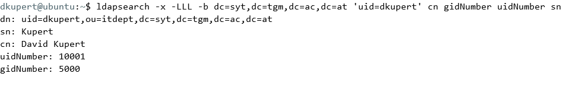
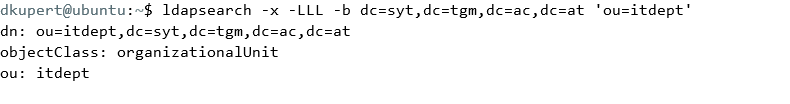

## SYT EK734 DezSys/Middleware Engineering "Interface Development using Naming Services" (MICT)

## Aufgabenstellung

Die detaillierte [Aufgabenstellung]() beschreibt die notwendigen Schritte zur Realisierung.

## Recherche

### LDAP

## Voraussetzung

### LDAP - Aufsetzen

Da wir bereits in einem früheren Übungsblock einen LDAP-Server aufgesetzt haben, habe ich mich dazu entschlossen die Übung zu "Recyceln".

[LDAP-Aufsetzen](https://github.com/dkupert-tgm/SYT_SWISS-ARMY-KNIFE/blob/master/Ubuntu_LDAP-Aufsetzen.md)

## Implementierung

### LDAP-Daten einspielen [1,2,3]

Um LDAP-Daten haben wir 2 Möglichkeiten:

* die Daten mit einem eigenen LDAP-File mit der Extension .ldif einzuspielen
* die Daten mittels einen bash-Befehl `ldapadd` jeweils in der Konsole einzugeben

Ich habe mich für die erste Option entschieden, da man durch diese die Ergebnisse (bzw. Übung) leichter reproduzieren kann.

| Bezeichnung im .ldif File | Bedeutung           |
| ------------------------- | ------------------- |
| cn                        | Common Name         |
| ou                        | Organizational Name |
| dc                        | Domain Component    |


#### LDAP - posixGroup 

##### Aufbau / Syntax:

```ldap
dn: cn=<username>,ou=Group,dc=your,dc=domain
objectClass: posixGroup
objectClass: top
cn: <username>
gidNumber: <Unique GID Number>
description: "<Group Description>"
```

##### ObjectClass Definition [1]

The ObjectClass Type is defined as:

- OID: 1.3.6.1.1.1.2.2
- NAME: PosixGroup
- DESC: Abstraction of a group of accounts'
- SUP: top
- AUXILIARY
- MUST:
  - gidNumber
- MAY:
  - authPassword
  - userPassword
  - memberUid
  - description

#### LDAP - posixAccount

##### Aufbau / Syntax:

```ldap
dn: uid=<username>,ou=People,dc=your,dc=domain
uid: <username>
cn: <username>
givenName: <First Name>
sn: <Last Name>
mail: <e-mail address>
objectClass: inetOrgPerson
objectClass: posixAccount
objectClass: top
objectClass: shadowAccount
objectClass: ldapPublicKey
shadowMax: 180
shadowMin: 1
shadowWarning: 7
shadowLastChange: 10701
sshPublicKey: <some SSH public key>
loginShell: /bin/bash
uidNumber: <some UID number above 1000>
gidNumber: <GID number from above>
homeDirectory: /home/<username>
userPassword: <slappasswd generated SSHA hash>
pwdReset: TRUE
```

##### ObjectClass Definition [4]

The ObjectClass Type is defined as:

* OID: 1.3.6.1.1.1.2.0 
* NAME: PosixAccount 
* SUP: top
*  AUXILIARY 
* MUST: 
  * cn 
  * uid 
  * uidNumber 
  * gidNumber 
  * homeDirectory 
* MAY: 
  * loginShell 
  * gecos 
  * description 
  * authPassword 
* Extended Flags 
  * X-NDS_NOT_CONTAINER: 1

Die [Datei](daten.ldif)

Nun kann man die Daten mit folgendem Befehl einspielen

```bash
ldapadd -x -D cn=admin,dc=syt,dc=tgm,dc=ac,dc=at -W -f daten.ldif
```

### LDAP-Search

###### Alle Einträge anzeigen

Da wir unsere Daten haben, können wir zu erst Testen ob diese auch auf dem Server sind. Probieren wir mal alle Einträge anzuzeigen mit dem Befehl.

```bash
sudo ldapsearch -D "uid=chris,ou=itdept,dc=syt,dc=tgm,dc=ac,dc=at" -h 192.168.176.159 -b "dc=syt,dc=tgm,dc=ac,dc=at" -W -p 389 -s sub "(objectclass=*)"
```

Dieser Befehl fordert uns auf das Passwort des Benutzer **chris** einzugeben.

###### Bestimmten Eintrag anzeigen

Wenn man jetzt nur die Daten eines bestimmten User bekommen möchte so kann man dies mit dem Befehl:

```bash
ldapsearch -x -LLL -b dc=syt,dc=tgm,dc=ac,dc=at 'uid=someUID' cn gidNumber
```

machen. Wobei man nach 'uid=someUID' alle Attribute des Benutzer listen kann



###### Die Daten einer posixGroup

```bash
ldachsearh -x -LLL -b dc=syt,dc=tgm,dc=ac 'ou=itdept' 
```



### JDNI[7]

Kommen wir jetzt zum letzten Teil unserer Aufgabe die Implementierung eines Java-Programms, welches mit LDAP kommuniziert.

##### Verbindung mit LDAP

```java
Hashtable env = new Hashtable();
env.put(Context.INITIAL_CONTEXT_FACTORY,"syt.tgm.ac.at");
env.put(Context.PROVIDER_URL, "ldap://serverURL/");
DirContext ctx = new InitialDirContext(env);

```

Wenn man verbunden ist muss sich ein User mit dem Server authentifizieren, sowas wird auch bind-process genannt. Hierbei muss das Java-Programm bestimmte Attribute in der Variable Context setzen.

```java
Hashtable env = new Hashtable();
env.put(Context.INITIAL_CONTEXT_FACTORY,"com.sun.jndi.ldap.LdapCtxFactory");
env.put(Context.PROVIDER_URL, "ldap://localhost:389");
env.put(Context.SECURITY_AUTHENTICATION,"simple");
env.put(Context.SECURITY_PRINCIPAL,"cn=Directory Manager"); // specify the username
env.put(Context.SECURITY_CREDENTIALS,"password"); // specify the password
DirContext ctx = new InitialDirContext(env);
```

Nun kann man mit den Context Arbeiten.

##### Attribute eines Users bekommen

```java
DirContext ctx = new InitialDirContext(env);
Attributes att = ctx.getAttributes("uid=dkupert,ou=itdept,dc=syt,dc=tgm,dc=ac,dc=at");
// given Name herausfinden
att.get("givenName");
// Bind-process
att.getEnvironment();
```

## Quellen

[1] : "" [online](https://ldapwiki.com/wiki/PosixGroup) | zuletzt beuscht 22.01.2020

[2] : "What are cn, dn etc." [online](https://stackoverflow.com/questions/18756688/what-are-cn-ou-dc-in-an-ldap-search) | zuletzt beuscht 23.01.2020

[3] : "LDAP Data Interchange Format" [online](https://en.wikipedia.org/wiki/LDAP_Data_Interchange_Format) | zuletzt beuscht 23.01.2020

[4] : "PosixAccount" [online](https://ldapwiki.com/wiki/PosixAccount) | zuletzt beuscht 23.01.2020

[5] : "Examples of LDAPsearch" [online](https://access.redhat.com/documentation/en-US/Red_Hat_Directory_Server/8.2/html/Administration_Guide/Examples-of-common-ldapsearches.html) | zuletzt beuscht 23.01.2020

[6] : "LDAP Query Example" [online](https://ldapwiki.com/wiki/LDAP Query Examples) | zuletzt beuscht 23.01.2020

[7] : "Connecting to LDAP server using JNDI in Java " [online](https://www.codejava.net/coding/connecting-to-ldap-server-using-jndi-in-java) | zuletzt beuscht 23.01.2020

